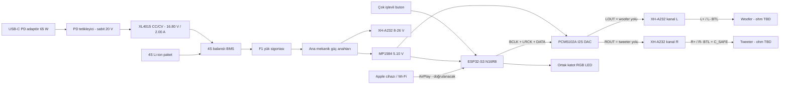
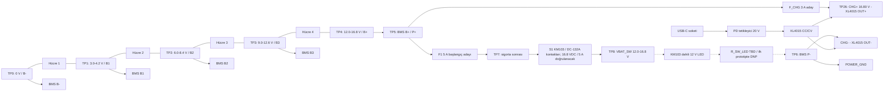
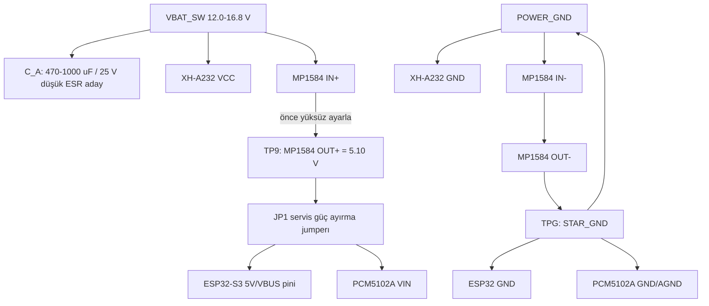
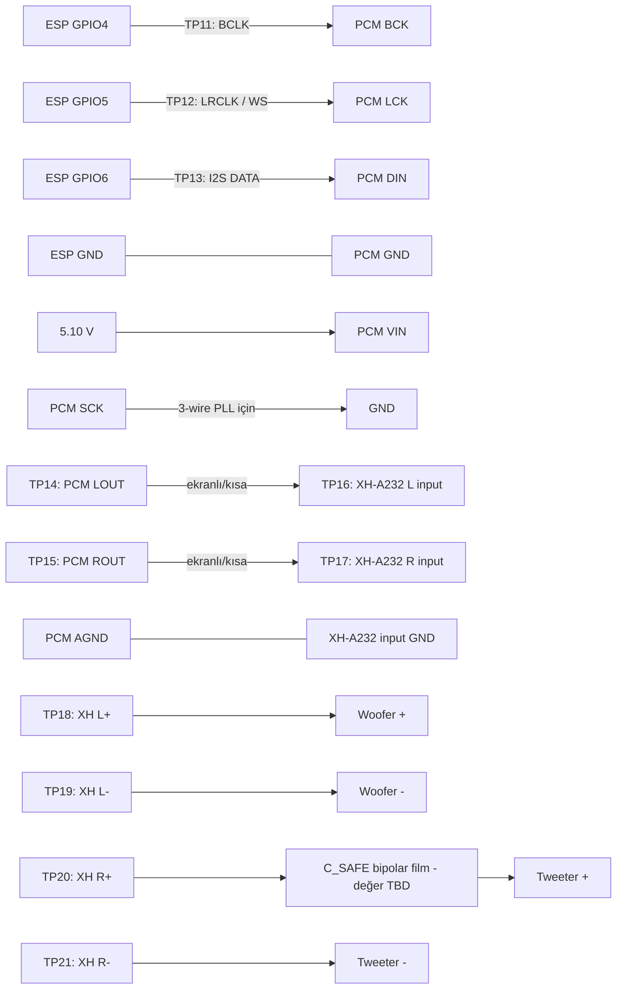
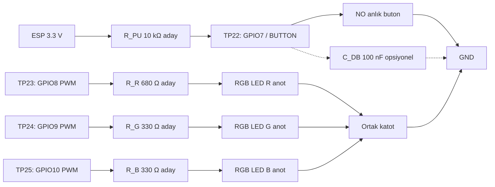
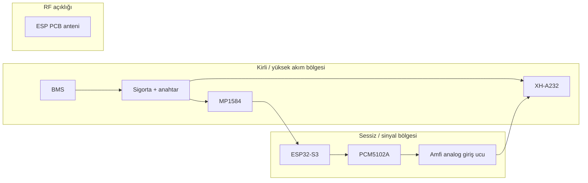
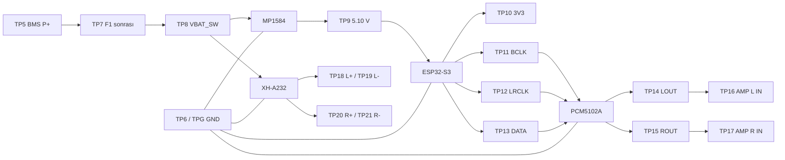
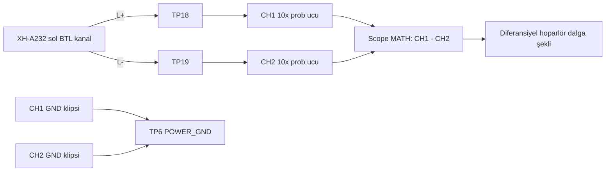

# Devre ve bağlantı şemaları

Bu belge **tek Harman Kardom hoparlör** için modül-temelli prototip bağlantı planıdır. Dört hoparlörde aynı devre tekrarlanır. Şema, özel üretim PCB şeması değildir; modüllerin gerçek baskı yazıları ve süreklilik ölçümleri görülmeden kablo bağlanmaz.

> [!danger] Enerji verme yasağı
> Nova woofer/tweeter değerleri G0 ile ölçülmeden gerçek sürücülere tam güç uygulanmaz. XH-A232 önce akım sınırlı laboratuvar kaynağı ve dummy-load ile G1 testinden geçer. Tweeter, `C_SAFE` seri koruma kondansatörü ile DSP HPF/limiter doğrulanmadan bağlanmaz.

## Devre şeması


Tek sayfalık pafta; USB-C PD şarj zinciri, 4S paket ve BMS, sigorta ve ana anahtar, 5 V lojik beslemesi, ESP32-S3 N16R8, PCM5102A, XH-A232 BTL bi-amp, sürücüler, kullanıcı arayüzü ve `TP0-TP27` ölçüm noktalarını gösterir. Ölçeklenebilir SVG'dir; Obsidian ve GitHub üzerinde doğrudan açılır.

Pafta `hardware/diagrams/generate_schematic_svg.py` ile üretilir ve elle düzenlenmez. Bu çizim modül-temelli prototip içindir; üretim PCB şeması yerine geçmez.

### Düzenlenebilir KiCad paftası

Netlist, ERC ve ileride PCB için elektriksel kaynak KiCad projesidir: [[kicad-schematic|KiCad şeması ve üretim scripti]]. Script ve `.kicad_pro` `hardware/kicad/` altında Git'te tutulur. Üretilen `.kicad_sch` **şu an depoda yok**: ADR-0011 ile üreteç değişti ve bu makinede KiCad sembol kütüphaneleri kurulu olmadığı için çıktı yenilenemedi, eldeki dosya da artık yanlış pin atamasını gösteriyordu. `scripts/check_generated_kicad.py` üreteç ile çıktının ayrışmasını CI'da yakalar; geri getirme komutları `hardware/kicad/README.md` içinde.

İki çıktı bilerek ayrıdır: SVG paftası okunabilirlik ve bring-up prosedürü için, KiCad paftası elektriksel doğrulama için tutulur. İkisi de aynı net adlarını ve aynı `TP0-TP27` numaralandırmasını kullanır.

## 1. Sistem bağlantı özeti



## 2. 4S batarya, BMS, şarj ve yük hattı

### 2.1 Hücre ölçüm noktaları

Bu çizim **common-port 4S Li-ion BMS** referansıdır. BMS üzerindeki `B- / B1 / B2 / B3 / B+ / P- / P+` yazıları fiziksel kartta doğrulanır.



### 2.2 BMS bağlantı sırası

1. BMS veri sayfasındaki bağlantı sırasını esas al; yoksa ürünü kullanma.
2. Hücreleri tek tek ölç: bitişik düğümler yaklaşık aynı hücre gerilimini göstermeli.
3. Önce `B-`, ardından `B1`, `B2`, `B3`, son olarak `B+` bağlanması birçok kartta kullanılır; **satın alınan kartın talimatı farklıysa kart talimatı geçerlidir**.
4. BMS ölçüm soketini takmadan önce soket üzerinde sıralamayı multimetreyle doğrula.
5. Yük ve şarj bağlantılarını hücre düğümleri doğrulandıktan sonra yap.

> [!warning] Separate-port BMS
> Kartta `C-` varsa şarj cihazı eksi ucu `C-`, yük eksi ucu `P-` olur. `C-` ile `P-` keyfi olarak birleştirilmez. Yukarıdaki çizim yalnız common-port kart içindir.

### 2.3 Ana güç dağıtımı



- MP1584 çıkışını ESP32/DAC bağlı değilken `5.10 V` değerine ayarla; sonra elektronik yükle doğrula.
- ESP32 USB ile programlanırken `JP1` açılır. Geliştirme kartının USB ile harici `5 V` hattını güvenle OR'ladığı kanıtlanmadıkça iki kaynak aynı anda bağlanmaz.
- XH-A232 girişinde kart üzerinde yeterli bulk kapasitör yoksa amfiye yakın `470-1000 µF / 25 V` düşük-ESR kondansatör adayı denenir. Değer G1/G3 ölçümüyle kesinleşir.
- `F1=5 A` yalnız başlangıç test adayıdır; kablo kesiti, anahtar DC kesme değeri ve ölçülen tepe akımıyla yeniden boyutlandırılır.
- `S1` için seçilen KM103 / DC-132A parçasının fiziksel üç pin sırası süreklilik ve diyot moduyla bulunacaktır; çizimdeki pin işlevleri mantıksaldır. Kontak değeri belgelenmeden ana batarya hattı enerjilenmez.
- Anahtarın dahili ışığı yalnız 12 V DC sınıfındadır. İlk prototipte LED dönüş pini açık bırakılır. Işık kullanılacaksa 12 V'taki akım ölçülür, 16,8 V tam dolu durumda aynı akımı aşmayacak `R_SW_LED` en az 1/4 W seri dirençle LED dönüş hattına eklenir.

## 3. ESP32-S3 -> PCM5102A -> XH-A232 ses zinciri

### 3.1 Aday ESP32-S3 pin planı

Bu GPIO tablosu [[../07-decisions/ADR-0010-esp32-s3-n16r8-board|ADR-0010]] ile kilitlenen ESP32-S3 **N16R8** (16 MB flash + 8 MB PSRAM) kartı için **prototip adayıdır**. Kart seçimi `accepted`, pin ataması `candidate`: satın alınan kartın şeması ve boot testi görülmeden pin tablosu `accepted` yapılmaz.

| İşlev | ESP32-S3 aday GPIO | Modül ucu | Not |
|---|---:|---|---|
| I2S BCLK | GPIO4 | PCM5102A `BCK` | Kısa ve GND referanslı kablo |
| I2S LRCLK/WS | GPIO5 | PCM5102A `LCK/LRCK` | Kanal saat sinyali |
| I2S DATA OUT | GPIO6 | PCM5102A `DIN` | ESP -> DAC tek yön |
| DAC SCK/MCLK | Bağlanmaz | PCM5102A `SCK` -> GND | 3-wire BCK-PLL modu; modül jumperı doğrulanır |
| Fonksiyon butonu | GPIO7 | Buton -> GND | Active-low; 10 kΩ pull-up aday |
| RGB kırmızı | GPIO8 | `R_R` -> LED R | PWM |
| RGB yeşil | GPIO9 | `R_G` -> LED G | PWM |
| RGB mavi | GPIO10 | `R_B` -> LED B | PWM |
| I2C SDA | GPIO11 | INA226 SDA | Opsiyonel |
| I2C SCL | GPIO12 | INA226 SCL | Opsiyonel |
| Amfi susturma | GPIO21 | TPA3110 `SD` | **Aktif düşük.** 10 kΩ pull-down zorunlu. Rezervasyon: `SD` pad erişimi henüz doğrulanmadı |
| DAC susturma | GPIO13 | PCM5102A `XSMT` | **Aktif düşük.** 10 kΩ pull-down zorunlu |
| Paket gerilimi | GPIO1 | Bölücü -> ADC1_CH0 | Bölücü oranı `G3`/`G4`'ten gelir |
| Hücre sıcaklığı | GPIO2 | NTC ağı -> ADC1_CH1 | Ağ ve eşikler `G4`'ten gelir |

Tablo [[../07-decisions/ADR-0011-audio-side-gpio-reservation|ADR-0011]] ile genişletildi.

`GPIO6` ürünün dışında ikinci bir işe daha koşuluyor: tezgâhtaki geliştirme kartında S/PDIF çıkışı aynı pinden sürülüyor, bkz. 3.5. Ürün kablolamasında bu pin yalnız `DIN`'e gider.

Sıralamanın kendisi `firmware/components/hk_audio/` içinde yazılı ve host'ta test edilmiş: açarken saat -> DAC -> amfi, kapatırken **önce amfi**. TPA3110 veri sayfası kapanış pop'u için shutdown'ın güçten önce verilmesini söylüyor; DAC'ı önce susturup amfiyi sonra kapatmak, DAC'ın kendi geçişini canlı bir amfiden geçirirdi.

**Susturma hatlarındaki pull-down opsiyonel değildir; susturma mekanizmasının kendisidir.** Bu parçadaki her GPIO reset'ten yüksek empedanslı çıkar ve ROM, bootloader ve uygulama başlangıcı boyunca öyle kalır — yüzlerce milisaniye. O pencerede amfiyi susturan tek şey harici dirençtir. Yazılımın işi susturmayı **bırakmaktır**; firmware hiç çalışmazsa hoparlörler sessiz kalır.

`GPIO18/19/20` susturma hattı olamaz: silikon bunları açılışta HIGH sürer. `GPIO0/39/43/44` de olamaz: zayıf dahili pull-up ile açılırlar. İkisi de yazılım var olmadan amfiyi serbest bırakırdı.

Kaçınılan pinler: boot/strapping `GPIO0/3/45/46`, native USB `GPIO19/20`, SPI flash `GPIO26-32`, **oktal PSRAM `GPIO33-37`** (N16R8'in R8'i), UART0 konsolu `GPIO43/44`, ve S3 die'ında var olmayan `GPIO22-25`. Tamamı `hk_pins.h` içinde derleme zamanında reddedilir — ESP-IDF bu kart yapılandırmasında `GPIO33-37`'yi rezerve **etmez**, gerekçesi ADR-0011'de. Kesin kart farklıysa tablo yeniden hazırlanır.

### 3.2 I2S ve analog bağlantı



### 3.3 PCM5102A modül ayarları

Mor PCM5102A modül ailesinde kontrol padleri genellikle `FLT`, `DEMP`, `XSMT`, `FMT` olarak çıkar. Modül revizyonu süreklilik ölçümüyle doğrulandıktan sonra başlangıç hedefi:

| Sinyal | Başlangıç hedefi | Amaç |
|---|---|---|
| `SCK` | GND | 3-wire I2S; saat BCK üzerinden dahili PLL |
| `FMT` | LOW | Standart I2S formatı |
| `FLT` | LOW | Normal latency filtre |
| `DEMP` | LOW | De-emphasis kapalı |
| `XSMT` | HIGH / kart varsayılanı | DAC çıkışı aktif; ileride kontrollü mute değerlendirilebilir |

PCM5102A çipi harici SCK olmadan BCK PLL ile çalışabilir. Ancak modülün altındaki lehim köprüleri satıcıdan satıcıya farklı olabilir; pad ismine bakıp körlemesine lehim yapılmaz.

### 3.4 Kanal ve sürücü kuralları

- Firmware sol dijital kanalı `woofer`, sağ dijital kanalı `tweeter` yolu olarak üretir.
- XH-A232 `L+ / L-` ve `R+ / R-` çıkışları BTL'dir. Hiçbir `-` hoparlör ucu GND/şaseye bağlanmaz.
- `C_SAFE` tek başına crossover değildir; DSP HPF ve limiter'a karşı son savunma katmanıdır.
- `C_SAFE` değeri tweeter nominal empedansı ve güvenli alt frekansı ölçülmeden yazılmaz. İlk hesap: `C = 1 / (2π × R_tweeter × f_safe)`; seçilen değer G2 test raporuna girer.
- Amfi kanal eşlemesi kabin içinde etiketlenir; firmware ve kablo aynı sürüm numarasını taşır.

### 3.5 S/PDIF tezgâh çıkışı — ürün kablolamasında yoktur

> [!warning] Bu üç parça kabine girmez
> Ürünün ses yolu [[../07-decisions/ADR-0002-biamp-signal-chain|ADR-0002]] ile I2S -> PCM5102A -> XH-A232'dir ve öyle kalır. Aşağıdaki devre yalnız geliştirme kartında, kullanıcının kendi harici DAC'ına bağlanmak içindir. BOM'a, kabin içi kablo demetine ve `TP` numaralandırmasına dahil değildir.

Neden var: geliştirme kartında PCM5102A yok (ADR-0012) ve sipariş edilen modüller gelmedi, yani I2S'in üç pini hiçbir şeye sürüyordu — zincirin duyulabilir hiçbir çıktısı olmuyordu. Vendor edilen alıcı `audio_output_spdif.c` taşıyor: BMC (biphase-mark) kodlamasını modern `i2s_std` sürücüsü üzerinden bit-bang edip tek veri pininden gerçek bir S/PDIF akışı üretiyor. Bit ve kelime saati dışarı hiç çıkmaz. Açılışta `SPDIF output ready rate=44100x2 dma=192x2` satırı görülür; buradaki `x2` BMC'nin iki katına çıkardığı bit hızıdır, örnekleme oranı değil. 2026-09-05'te bir FiiO Q15'in coax girişi 44.1 kHz'e temiz kilitlendi ve ses duyuldu; ham kayıt [[../06-testing/devkit-bring-up|geliştirme kartı bring-up notundadır]].

**Pin çakışması bu bölümün asıl uyarısıdır.** Çıkış, 3.1 tablosunda `I2S DATA OUT` olarak duran `GPIO6`'dır: ADR-0011 o pini ses verisine ayırmıştı ve `hk_airplay.c` seçimi derleme anında `hk_pins`e karşı doğruluyor. S/PDIF, I2S'in yanına eklenmez, **yerine geçer**. Bu çıkış etkinken `BCLK` ve `LRCLK` sürülmez; aynı anda bir PCM5102A beslenemez.

Arayüz üç pasif parçadır. Şartname 75 Ω yükte `0.5 V ±%20` tepe ister, yani `0.4-0.6 V`; GPIO ise 3.3 V sallar. `R1/R2` bölücüsü hem seviyeyi indirir hem kaynak empedansını 75 Ω'a yaklaştırır, `100 nF` DC'yi keser:

```text
GPIO6 --[R1]--+--[100 nF]-- coax merkez
              |
            [R2]
              |
GND ----------+------------ coax toprak
```

| R1 / R2 | 75 Ω yükte tepe | Kaynak Z | Not |
|---|---:|---:|---|
| 210 Ω / 110 Ω | 0.578 V | 72.2 Ω | Vendor edilen dosyanın kendi değeri; %1 seri gerekir |
| 220 Ω / 120 Ω | 0.572 V | 77.6 Ω | E24; kaynak empedansı 75 Ω'a en yakın olan |
| 220 Ω / 100 Ω | 0.538 V | 68.8 Ω | E24 |
| 270 Ω / 150 Ω | 0.516 V | 96.4 Ω | E24; seviye içeride, kaynak Z 75 Ω'dan uzak |
| 330 Ω / 100 Ω | 0.379 V | — | **Kullanma**; şartnamenin 0.4 V tabanının altında |

Son satır tabloya bilerek konuldu: `330/100` bu iş için yaygın olarak önerilir ve tepe değeri şartnamenin alt sınırının altında kalır. Bir DAC onunla kilitlenebilir de kilitlenmeyebilir de; kilitlenirse bu alıcının tolerans payıdır, devrenin doğruluğu değil. Direnç kutusunda `210/110` yoksa `220/120` alınır.

Akış 44.1 kHz / 16 bit'te sabittir. Bunun nedeni bu kart değildir ve firmware ayarıyla yükseltilemez; gerekçesi bring-up notundadır.

Bu çıkış hiçbir fiziksel kapıyı ilerletmez: dönüşümü kullanıcının kendi DAC'ı yapar ve bilinmeyen bir sürücüye enerji verilmez. Bölüm başındaki enerji verme yasağı ile G0-G2 sırası aynen geçerlidir.

## 4. Buton ve RGB LED



- ESP32 dahili pull-up kullanılabilir; harici `10 kΩ` gürültülü kabin ortamında başlangıç adayıdır.
- `100 nF` donanımsal debounce opsiyoneldir; firmware yine 50 ms debounce uygular.
- LED dirençleri gerçek LED ileri gerilimi ve hedef 2-5 mA akıma göre hesaplanır. Hazır RGB modülde direnç varsa harici dirençler yeniden değerlendirilir.
- LED ve buton kabloları Class-D hoparlör kablolarından ayrılır.

## 5. Kablo demeti ve konnektör planı

| Konnektör | Pinler | Öneri |
|---|---|---|
| J1 batarya/BMS | `P+`, `P-` | Kilitli, polarize, en az ölçülen akım + %50 marj |
| J2 anahtarlı güç | `VBAT_SW`, `POWER_GND` | Amfi ve buck için yıldız dağıtım |
| J3 I2S | `GND`, `BCK`, `LCK`, `DIN` | GND-sinyal eşleşmeli, kısa; hoparlör çıkışından uzak |
| J4 DAC analog | `LOUT`, `AGND`, `ROUT` | Kısa ekranlı kablo; ekran tek uç/topoloji G3'te test edilir |
| J5 woofer | `L+`, `L-` | Bükümlü çift, polarize |
| J6 tweeter | `R+ -> C_SAFE`, `R-` | Bükümlü çift, farklı anahtar/konnektör ile yanlış takma önlenir |
| J7 UI | `3V3`, `BUTTON`, `LED_R/G/B`, `GND` | Düşük akım, güç/speaker kablolarından ayrı |
| J8 şarj girişi | `USB_PD_VBUS`, `POWER_GND` | USB-C soketi veya PD tetikleyici girişi. V1'de ayrı DC jak yoktur; 16,80 V zincir içinde üretilir. Yedek hazır adaptör yoluna geçilirse bu satır jak ölçüsü/polaritesiyle yeniden yazılır. |

## 6. Fiziksel yerleşim



- PCB anteninin önünde metal, batarya veya kablo demeti bırakılmaz.
- MP1584 indüktörü ve XH-A232 çıkış indüktörleri PCM5102A analog ucundan uzak tutulur.
- Analog ses kablosu hoparlör çıkış kablosuyla paralel uzun mesafe gitmez.
- Güç ve analog dönüşler gelişigüzel zincirlenmez; `STAR_GND` noktası G3 gürültü ölçümünde belirlenir.
- Batarya bölmesi akustik hacimden ayrılır; NTC orta hücre grubuna termal temas eder.

## 7. Test noktaları ve osiloskop planı

### 7.1 Test noktası yerleşimi

PCB veya kablo dağıtım kartında test noktaları iğne probla erişilebilir, kısa devre oluşturmayacak aralıkta ve ipek baskıda `TPx` adıyla işaretlenir. Güç test noktalarında halka/klips tipi, hızlı dijital ve analog ses noktalarında küçük pad kullanılır.

| TP | Konum | Referans | Beklenen değer / dalga | Araç ve ilk kontrol |
|---|---|---|---|---|
| TP0 | Paket `B-` | TP0 | 0 V referans | DMM; ham hücre ölçüm referansı |
| TP1 | Hücre 1 üstü / B1 | TP0 | 3.0-4.2 V DC | DMM; komşu hücre farkını da ölç |
| TP2 | Hücre 2 üstü / B2 | TP0 | 6.0-8.4 V DC | DMM |
| TP3 | Hücre 3 üstü / B3 | TP0 | 9.0-12.6 V DC | DMM |
| TP4 | Paket `B+` | TP0 | 12.0-16.8 V DC | DMM |
| TP5 | BMS `P+` | TP6 | BMS açıkken paket gerilimi | DMM; korumada çıkış kesilebilir |
| TP6 | BMS `P-` / POWER_GND | TP6 | 0 V yük referansı | DMM/scope ground referansı |
| TP7 | F1 sonrası | TP6 | TP5'e yakın; yükte sigorta/kablo düşümü | DMM; `TP5-TP7` mV düşüm |
| TP8 | Anahtar sonrası `VBAT_SW` | TP6 | 12.0-16.8 V açık, 0 V kapalı | DMM; scope ile transient/ripple |
| TP9 | MP1584 5 V çıkışı | TPG | 5.10 V ayar; hedef 5.00-5.20 V | DMM + scope; yükte droop/ripple |
| TP10 | ESP32 kart 3V3 | TPG | Taslak hedef 3.15-3.45 V | DMM + scope; brownout gözlemi |
| TP11 | I2S BCLK | TPG | 0-3.3 V; 44.1 kHz için 1.4112/2.8224 MHz veya 48 kHz için 1.536/3.072 MHz | Scope 10x; gerçek slot genişliğine göre |
| TP12 | I2S LRCLK/WS | TPG | 0-3.3 V; 44.1 veya 48 kHz | Scope/logic analyzer |
| TP13 | I2S DATA | TPG | 0-3.3 V veri | Scope/logic analyzer |
| TP14 | PCM5102A LOUT | PCM AGND | Woofer analog yolu; 0 dBFS'te çip sınırı yaklaşık 2.1 Vrms | Scope AC coupling; önce -40 dBFS |
| TP15 | PCM5102A ROUT | PCM AGND | Tweeter analog yolu | Scope AC coupling; önce -40 dBFS |
| TP16 | XH-A232 L input | giriş GND | TP14'e yakın, kart giriş ağına bağlı | Scope AC coupling |
| TP17 | XH-A232 R input | giriş GND | TP15'e yakın | Scope AC coupling |
| TP18/TP19 | XH `L+` / `L-` | Birbirine diferansiyel | Woofer BTL PWM + diferansiyel audio | Diferansiyel prob veya CH1-CH2 |
| TP20/TP21 | XH `R+` / `R-` | Birbirine diferansiyel | Tweeter BTL PWM + diferansiyel audio | Diferansiyel prob veya CH1-CH2 |
| TP22 | Buton GPIO7 | TPG | Boşta yaklaşık 3.3 V, basılı 0 V | DMM/scope; debounce |
| TP23/24/25 | LED R/G/B anot sürüşü | TPG | 0-3.3 V PWM | Scope; PWM frekansı ve audio paraziti |
| TP26 | XL4015 çıkışı `CHG+` | TP6 veya C- | Yüksüz 16,80 V ± kalibrasyon toleransı | Önce **batarya bağlı değilken** DMM; polarite ve akım sınırı ayarı |
| TP27 | NTC iki ucu | BMS şemasına göre | Direnç/sıcaklık ilişkisi | Enerjisiz ohmmetre; BMS'e göre |

`TP10` ESP32 geliştirme kartının gerçek `3V3` pininden alınır. Kart regülatörü ve USB güç topolojisi görülmeden 3V3 hattına harici enerji verilmez.

### 7.2 Test noktalarının şematik görünümü



### 7.3 Osiloskop güvenlik kuralları

> [!danger] BTL çıkışa şase klipsi takma
> Masa tipi osiloskopların prob GND klipsleri çoğunlukla koruma toprağına ve birbirine bağlıdır. `TP18`, `TP19`, `TP20` veya `TP21` uçlarından hiçbirine GND klipsi takma. Bu uçlar “hoparlör eksi/GND” değildir; iki uç da Class-D yarım-köprü çıkışıdır.



Sağ kanal ölçümünde aynı bağlantı `TP20=CH1`, `TP21=CH2` olarak tekrarlanır. Diferansiyel prob varsa prob doğrudan iki BTL ucu arasına bağlanır ve masa tipi tek uçlu prob yöntemine tercih edilir.

BTL ölçümü için tercih sırası:

1. Yeterli common-mode ve diferansiyel gerilim sınıfına sahip **diferansiyel probu** `L+ ↔ L-` veya `R+ ↔ R-` arasına bağla.
2. Diferansiyel prob yoksa iki aynı `10x` prob kullan: her iki probun GND klipsi yalnız `TP6 POWER_GND` noktasına; CH1 ucu `L+`, CH2 ucu `L-`; osiloskop matematiği `CH1 - CH2`. Sağ kanal için aynı yöntem.
3. Tek probu doğrudan hoparlör uçları arasına bağlama; probun şase klipsi çıkışa değmemeli.
4. Prob/osiloskop girişinin `VBAT`, PWM overshoot ve common-mode gerilim sınırlarını karşıladığını doğrula.
5. Amfi testi batarya yerine önce izolasyonu/toprak ilişkisi bilinen akım sınırlı laboratuvar kaynağıyla yapılır.
6. Şarj adaptörü bağlıyken osiloskop kullanmadan önce adaptör çıkışının PE/toprak ve DUT ile izolasyon ilişkisini ölç; belirsizse şarj sırasında scope bağlama.

TP8/TP9 besleme ripple ölçümü:

- `10x` prob, ground-spring veya çok kısa GND bağlantısı kullan.
- `20 MHz bandwidth limit` aç; önce DC coupling ile seviye, sonra AC coupling ile ripple gözle.
- TP9 için ilk taslak hedef: normal yükte `≤50 mVpp`, Wi-Fi akım sıçramasında `5 V` hattı `4.75 V` altına düşmemeli. Bunlar modül datasheet garantisi değil, G3 proje kabul hedefidir.
- TP10 için brownout/reset oluşturan çökme olmamalı; minimum değer kesin ESP32 kart ve brownout ayarıyla test raporunda kilitlenir.

### 7.4 Ses dalga şekli testi

Başlangıç test sinyali: `1 kHz`, önce `-40 dBFS`, ardından `-20 dBFS`. Tweeter bağlı değilken her iki DSP yolunun seviyesi TP14/TP15'te doğrulanır.

| Kademe | Yük | Ölçüm | Geçiş şartı |
|---|---|---|---|
| A | XH girişsiz | TP18-TP19 ve TP20-TP21 | Anormal DC/fault/ısınma yok |
| B | 8 Ω / en az 50 W non-inductive dummy-load | Diferansiyel 1 kHz çıkış | Önce 1.0 Vrms; temiz ve kararlı |
| C | 8 Ω dummy-load | Diferansiyel 2.83 Vrms | Yaklaşık 1 W; clipping yok |
| D | 8 Ω dummy-load | Kademeli Vrms + sıcaklık | Clipping ve termal sınır kaydedilir; sürücü yok |
| E | Woofer, düşük seviye | Diferansiyel + akustik | G2 woofer koruması |
| F | Tweeter + C_SAFE, çok düşük seviye | TP15 ve diferansiyel R çıkışı | HPF/limiter ölçümle doğrulanmış |

Dummy-load gücü `P = V_RMS² / R` ile hesaplanır. Osiloskop PWM'li ham BTL çıkışta yanlış RMS gösterebilir; diferansiyel prob, bant sınırı/filtre ve mümkünse true-RMS ölçüm veya audio analyzer ile çapraz kontrol edilir. TPA3110D2 tipik anahtarlama frekansı yaklaşık `310 kHz` olup veri sayfası aralığı `250-350 kHz`'dir; bu bileşen audio sinyali sanılmaz.

### 7.5 Güç açma/kapatma kaydı

Scope single-shot kaydı için kanallar:

- CH1: TP8 `VBAT_SW`.
- CH2: TP9 `5.10 V`.
- CH3: TP10 `3V3`.
- CH4: TP14 veya TP15 DAC analog çıkışı.

Varsa ayrı kayıtta XH `SD/MUTE` test pad'i eklenir. Açılış/kapanışta DAC pop, amfi pop, ESP brownout ve rail sıralaması kaydedilir. TPA3110D2 için en iyi power-off pop davranışı güç kesilmeden önce shutdown uygulanmasıdır; XH-A232 üzerinde `SD` erişimi yoksa bu açık donanım kararı olarak kalır.

## 8. Kademeli kurulum ve ölçüm planı

| Adım | Bağlanacaklar | Enerji kaynağı | Geçiş koşulu |
|---|---|---|---|
| S0 | Yalnız hücre/sürücü ölçümü | Enerjisiz | G0 verileri kayıtlı |
| S1 | XH-A232 + dummy-load | Akım sınırlı lab kaynağı 8-16.8 V | G1 güç, DC offset, clipping, termal |
| S2 | ESP32 + buck | Akım sınırlı lab kaynağı | 5 V ripple/brownout güvenli |
| S3 | ESP32 + PCM5102A + amfi + dummy-load | Lab kaynağı | I2S, kanal eşleme, pop ve gürültü |
| S4 | Woofer, düşük seviye | Lab kaynağı | Woofer HPF/limiter güvenli |
| S5 | Tweeter + `C_SAFE`, çok düşük seviye | Lab kaynağı | G2 crossover/limiter doğrulandı |
| S6 | 4S1P + BMS, kabin dışında | 16.8 V CC/CV / elektronik yük | G4 şarj, balans, NTC, koruma |
| S7 | Tam tek-hoparlör prototipi | 4S paket | G3/G5 EMI, pop ve termal |
| S8 | Dört tekrar | Dört doğrulanmış paket | G7/G8 senkron ve soak |

Her adım için [[../templates/test-report|test raporu]] oluşturulur. Fiziksel ölçüm kaydı olmadan gate `PASS` yapılmaz.

## 9. Açık kararlar

- [ ] Nova woofer ve tweeter DC direnci/empedans eğrisi.
- [ ] `C_SAFE` tipi ve değeri.
- [ ] Kesin ESP32-S3 kartı ve aday GPIO tablosunun boot/I2S doğrulaması.
- [ ] XH-A232 kartların dört fiziksel revizyonunun aynı olup olmadığı.
- [ ] XH-A232 kartında erişilebilir `SD/MUTE` noktası bulunup bulunmadığı; bulunursa pop önleme devresi.
- [ ] Common-port veya separate-port, NTC'li kesin BMS modeli.
- [ ] F1/F_CHG değeri, kablo kesiti ve konnektör akım sınıfı.
- [ ] USB ile harici 5 V arasında jumper, Schottky OR veya load-switch seçimi.
- [ ] INA226'nın yalnız prototip ölçümü mü yoksa kalıcı telemetri mi olacağı.
- [ ] XL4015 şarj sonlandırma davranışı ve sonlandırma yoksa uygulanacak çözüm (ADR-0009 G4 ölçümü).
- [ ] PD tetikleyicinin 20 V profilini yük altında koruyup korumadığı.
- [ ] `F_CHG` değeri ve XL4015 ters polarite koruma yöntemi.

## 10. Teknik kaynaklar

- [TI PCM5102A veri sayfası](https://www.ti.com/lit/ds/symlink/pcm5102a.pdf): 3-wire I2S/BCK PLL, kontrol pinleri ve analog çıkış.
- [TI TPA3110D2 veri sayfası](https://www.ti.com/lit/ds/symlink/tpa3110d2.pdf): BTL çıkış, 8-26 V besleme, shutdown ve decoupling/layout.
- [XH-A232 modül referansı](https://www.taydaelectronics.com/tpa3110-xh-a232-digital-stereo-audio-power-amplifier-board.html): kart sınıfı, 8-26 V ve 4-8 Ω satıcı bilgisi; güç etiketi ölçüm yerine geçmez.
- [Seçilen PCM5102A satın alma kaynağı](https://www.aletler.com.tr/urun/pcm5102a-dac-modul): fiziksel modül revizyonu teslim alınınca karşılaştırılır.
- [XLSEMI XL4015 veri sayfası](https://www.xlsemi.com/datasheet/XL4015%20datasheet.pdf): buck çalışma sınırları. Modül CC/CV kartıdır, şarj sonlandırma entegresi değildir.
- [USB PD spesifikasyonu](https://www.usb.org/document-library/usb-power-delivery): 20 V sabit profil anlaşması.

## 11. İlgili belgeler

- [[audio-signal-chain|Ses sinyal zinciri]]
- [[driver-measurements|Sürücü ölçüm planı]]
- [[board-and-pin-selection|Kart ve pin seçimi]]
- [[grounding-emi-thermal|Topraklama, EMI ve termal]]
- [[../power-and-battery-plan|Güç ve batarya planı]]
- [[../controls-and-provisioning-plan|Kontroller ve provisioning]]
- [[../06-testing/test-strategy|Test kapıları]]
- [[../06-testing/devkit-bring-up|Geliştirme kartı bring-up kaydı]]
- [[../07-decisions/ADR-0002-biamp-signal-chain|ADR-0002 — Bi-amp sinyal zinciri]]
- [[../07-decisions/ADR-0009-usb-c-pd-charge-chain|ADR-0009 — USB-C PD şarj zinciri]]
- [[../07-decisions/ADR-0010-esp32-s3-n16r8-board|ADR-0010 — Kanonik N16R8 kartı]]
